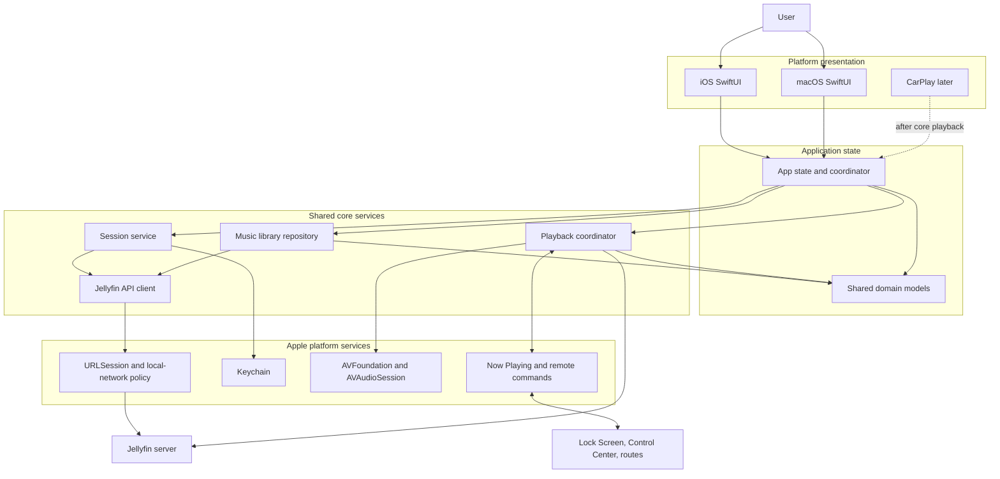
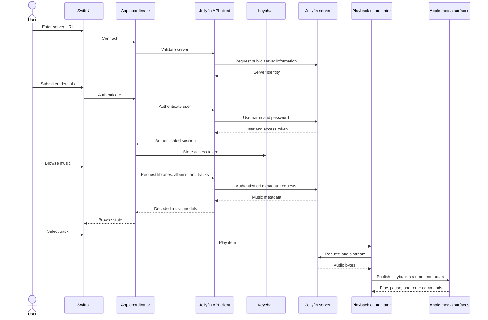

# Velacanto architecture

This document describes the intended 0.1.0 structure. It is a design target,
not a claim that every component has already been implemented.

## Component map



## Primary user journey



## Responsibilities

| Component | Owns | Must not own |
| --- | --- | --- |
| SwiftUI surfaces | Presentation, navigation intent, accessible controls | Endpoint construction, token persistence, audio-session policy |
| App coordinator | Session state, loading state, navigation state, service coordination | Raw Keychain, URLSession, or AVFoundation calls |
| Session service | Authentication, restoration, logout, stable device identity | Password persistence or library browsing |
| Jellyfin API client | Authenticated requests, endpoint details, response decoding | UI state or playback controls |
| Library repository | Music views, albums, tracks, artwork, browse errors | Credential storage or audio routing |
| Playback coordinator | Stream resolution, player state, interruptions, routes, system controls | User authentication or library presentation |
| Platform adapters | Keychain, networking policy, audio, now-playing integration | Product navigation or domain rules |

## Security and privacy boundaries

- The password is transient and is not persisted by Velacanto.
- The access token is stored in Keychain and removed on logout.
- Tokens and passwords must not appear in logs, fixtures, screenshots, or Git.
- Remote servers use HTTPS by default.
- Local servers require an explicit local-network purpose string and the
  narrowest transport-security policy that supports the approved use case.
- The privacy manifest must reflect the APIs and data flows actually present in
  the shipped target.

## Intended source layout

The exact Xcode group structure will be confirmed during project generation.
The intended responsibility split is:

```text
Velacanto/
├── App/
├── Features/
│   ├── Connection/
│   ├── Authentication/
│   ├── Library/
│   └── NowPlaying/
├── Core/
│   ├── JellyfinAPI/
│   ├── Session/
│   ├── Playback/
│   └── Models/
├── Platform/
│   ├── Keychain/
│   ├── Networking/
│   └── Media/
└── Resources/

VelacantoTests/
├── JellyfinAPI/
├── Session/
├── Playback/
└── Features/
```

## Related documents

- [0.1.0 plan](0.1-plan.md)
- [Roadmap](roadmap.md)
- [Architecture decisions](decisions/README.md)
- [Interactive visualization](visualizations/README.md)
