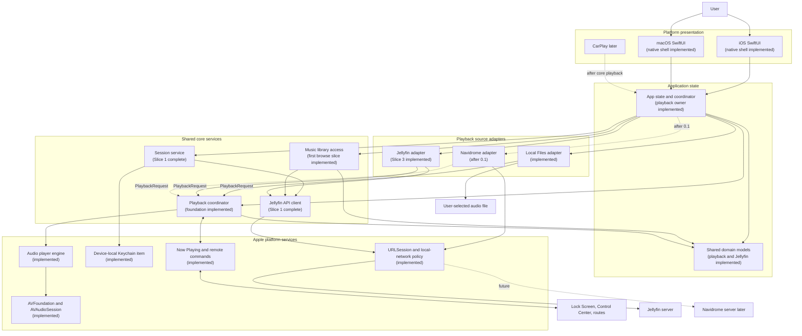
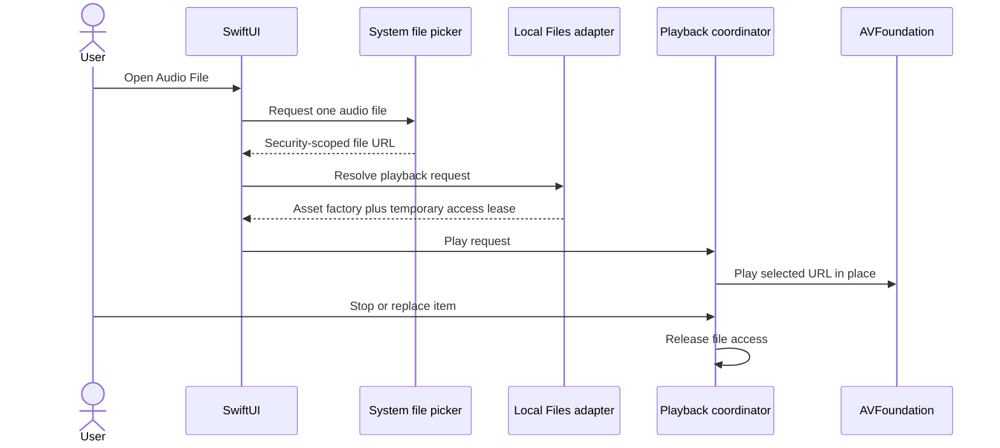
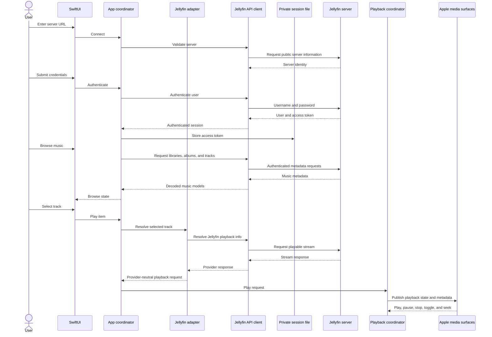
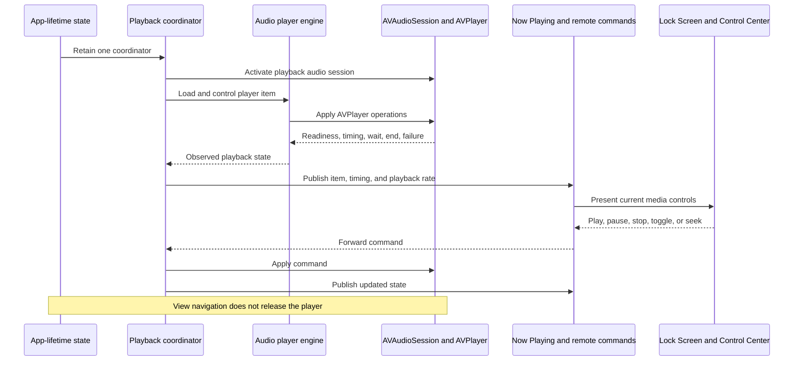

# Velacanto architecture

This document describes the architecture that 0.1 established and 0.2 must
preserve while reducing oversized UI and service change surfaces. It is a
design target, not a claim that every boundary is already reflected one-to-one
in the implementation. The [0.2 plan](0.2-plan.md) is the source of truth for
current delivery status.

## Component map



Every source adapter asynchronously resolves its own selection into the same
provider-neutral playback request. The coordinator therefore sees display
metadata, an opaque resource lease, and a playback-asset factory rather than
Jellyfin, Navidrome, or file-picker details. Local Files passes the selected URL
through unchanged and holds its security-scoped access only for the active item.
The app owns this coordinator rather than an individual view, so playback and
the temporary file-access lease survive navigation and backgrounding until the
user stops playback, replaces the item, or the app terminates.

The main-actor playback engine owns AVFoundation and translates item readiness,
waiting, playing, pause, completion, stall, and failure events into an explicit
provider-neutral playback state. Periodic time observations update the in-app
progress display; system Now Playing metadata is republished only when the item,
duration, seek position, or playback state changes.

## Delivery status

The 0.1 listening path is complete. Version 0.2 does not replace its provider,
session, playback, or platform boundaries; it separates the presentation and
service responsibilities that accumulated while delivering that path. In
particular, root composition, catalog presentation, artwork infrastructure,
and playback presentation need smaller, explicit owners. See the
[0.2 plan](0.2-plan.md) for the tracked work and guardrails.

## Local-file playback journey



## Primary user journey



## Background and system-control lifecycle



## Responsibilities

| Component | Owns | Must not own |
| --- | --- | --- |
| SwiftUI surfaces | Presentation, navigation intent, accessible controls | Endpoint construction, token persistence, audio-session policy |
| App coordinator | Session state, loading state, navigation state, service coordination | Raw file persistence, URLSession, or AVFoundation calls |
| Session service | Authentication, restoration, logout, stable device identity | Password persistence or library browsing |
| Jellyfin API client | Authenticated requests, endpoint details, response decoding | UI state or playback controls |
| Library repository | Music views, albums, tracks, artwork, browse errors | Credential storage or audio routing |
| Playback source adapters | Asynchronous source-specific asset resolution and the shortest required access lifetime | Transport controls, audio-session policy, or unrelated source APIs |
| Playback coordinator | Observed player state, opaque resource leases, audio-session policy, interruptions, routes, and system controls | User authentication, source-specific resolution, or library presentation |
| AVFoundation playback engine | Player-item readiness, timing, waiting, completion, stalls, and failures | Source identity, navigation, or authentication |
| Platform adapters | Private token persistence, networking policy, audio, now-playing integration | Product navigation or domain rules |

### Jellyfin collaboration invariants

- `JellyfinSessionController` is the only owner of published authentication and
  library-loading state. It snapshots that state before starting non-UI work;
  stale results must not repopulate the UI after logout or a different sign-in.
- `JellyfinCatalogRepository` owns catalog ordering, de-duplication, and
  multi-library cursor state. A cursor belongs only to its query, context, and
  library snapshot; views discard it when any of those inputs change.
- `JellyfinCatalogCache` serializes each server/user cache independently.
  Expired, version-mismatched, or corrupt data is a cache miss, not a session
  error. Its clock is injected for expiry tests. Logout clears only that
  account's cache.
- `JellyfinPlaybackRequestResolver` owns stream negotiation and reports for the
  duration of playback. It receives an authenticated client and item identity,
  never a catalog view model or navigation state.

## Security and privacy boundaries

- The password is transient and is not persisted by Velacanto.
- The access token is stored in a non-synchronizing Keychain item and removed
  on logout. On iOS it is device-local and available after first unlock, so
  background playback can restore it without a user-presence prompt.
- Real tokens and passwords must not appear in logs, fixtures, screenshots, or
  Git. Tests use clearly synthetic credential values.
- Remote servers use HTTPS by default.
- Local servers require an explicit local-network purpose string and the
  narrowest transport-security policy that supports the approved use case.
- The privacy manifest must reflect the APIs and data flows actually present in
  the shipped target.
- User-selected local files are played from their original URL. Velacanto does
  not copy, upload, index, or persist access to them.

## Source layout

The project now has the playback foundation, native app shell, and Jellyfin
vertical slice in place. The layout keeps endpoint, session, source-adapter,
and presentation responsibilities separated:

```text
Velacanto/
├── App/                         # implemented: app-lifetime ownership
├── Features/
│   ├── Jellyfin/                # connection, auth, and album tracks
│   ├── Library/                 # albums, artists, songs, and playlists
│   ├── Profile/                 # account, settings, and diagnostics
│   └── Search/                  # cross-library music search
├── Core/
│   ├── Models/                  # implemented: source and playback contracts
│   ├── Playback/                # implemented: coordinator and player engine
│   ├── Session/                 # implemented: restore, credentials, and logout
│   └── JellyfinAPI/             # implemented: auth, browse, and stream requests
├── Sources/
│   ├── LocalFiles/              # implemented
│   ├── Jellyfin/                # implemented: playback request adapter
│   └── Navidrome/               # after 0.1
├── Platform/
│   └── Media/                   # Now Playing and remote commands
└── Resources/

VelacantoTests/
├── PlaybackFoundationTests.swift
└── JellyfinFoundationTests.swift
```

Keychain token persistence currently lives beside the session boundary, and
networking policy lives in the Jellyfin API actor. They remain isolated behind
protocols even though the codebase is not yet large enough to justify separate
platform directories for each adapter.

## Related documents

- [0.2 plan](0.2-plan.md)
- [0.1.0 plan](0.1-plan.md) (historical release record)
- [Roadmap](roadmap.md)
- [Architecture decisions](decisions/README.md)
- [Interactive visualization](visualizations/README.md)
