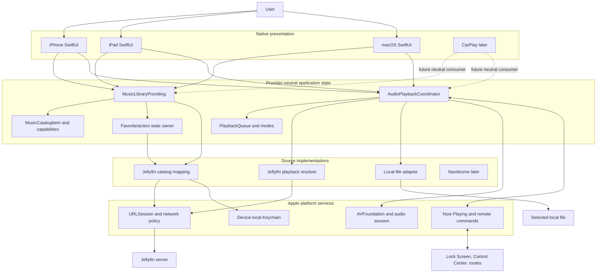
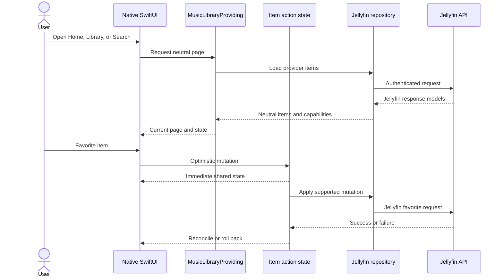
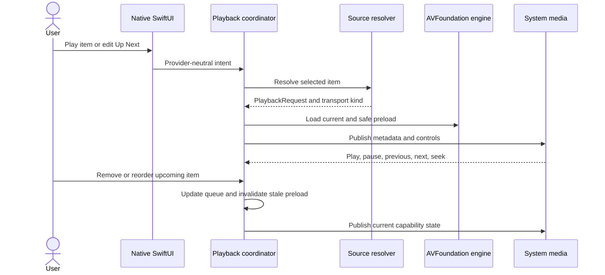

# Velacanto architecture

This document describes the target architecture for 0.3. The 0.2 playback,
session, catalog, and platform foundations remain valid; 0.3 closes the gap
where general library presentation still consumes Jellyfin-specific items.

## Component map

CarPlay is shown only as a future consumer. Version 0.3 adds no entitlement,
target, scene, or templates.

## Provider-neutral catalog contract

`MusicCatalogItem` is the presentation and action value for albums, artists,
songs, and playlists. It contains:

- an opaque source-scoped identifier;
- kind and display metadata;
- duration and artwork reference where available;
- provider-authoritative favorite state; and
- `MusicItemCapabilities` describing supported actions.

`MusicLibraryProviding` supplies paged library/search/detail/Home queries and
supported mutations. Jellyfin API response models are mapped at the repository
boundary and do not enter general Home, library, search, navigation, or playback
presentation.

Connection, authentication, and account management may remain explicitly
Jellyfin-specific because they are provider setup surfaces rather than general
music presentation.

### Catalog and mutation invariants

- IDs are opaque and source-scoped; display strings never establish identity.
- Page cursors belong to one query, context, account, and library snapshot.
- Stale query results cannot replace current state.
- One account-scoped state owner sequences favorite mutations and reconciles
  server results across visible item copies.
- Optimistic mutation failure restores the authoritative prior value and emits
  a user-safe error without item metadata or credentials in logs.
- Logout clears only the active account's transient mutation state and caches.

## Playback handoff

Every source asynchronously resolves its selection into a provider-neutral
`PlaybackRequest`. The request contains the `PlaybackItem`, opaque asset lease,
player-item factory, lifecycle reporter, and `PlaybackTransportKind`:

- Local File
- Direct Play
- Direct Stream
- Transcoding

Jellyfin continues to negotiate through `PlaybackInfo`; its response and play
method are mapped before the request reaches presentation. The coordinator owns
AVFoundation, audio-session policy, observed player state, and system media
integration for the app lifetime.

## Queue ownership and modes

`AudioPlaybackCoordinator` remains the sole public playback owner.
`PlaybackQueue` divides its sequence conceptually into history, current item,
and Up Next:

- History and the current item are not editable.
- Play Next inserts immediately after current; Play Last appends after current
  explicit and provider-expanded upcoming items.
- Remove and move affect only Up Next.
- Shuffle keeps current fixed and randomizes the remaining upcoming sequence
  once without duplicates.
- Repeat one restarts current; repeat all wraps at the queue boundary; off ends
  normally.
- A mutation that changes the preloaded next item cancels or replaces stale
  preload work before it can advance.
- Late source expansion appends only unseen items and never overwrites explicit
  user order.
- Relaunch persists a bounded window of 25 historical and 50 upcoming items,
  including explicit edits and playback modes.

## Primary browse and action journey

## Playback and system-control journey

## Responsibilities

| Component | Owns | Must not own |
| --- | --- | --- |
| SwiftUI surfaces | Presentation, navigation, accessible intent | Provider responses, endpoints, token storage, AVFoundation |
| Music library boundary | Neutral paging, search, details, Home collections, supported mutations | Platform navigation or playback engine |
| Provider repository | Jellyfin mapping, catalog ordering, cursors, request execution | General UI state or audio policy |
| Item action state | Sequencing, optimistic state, reconciliation, rollback | Endpoint construction or unrelated catalog paging |
| Playback source adapter | Source-specific resolution and shortest required resource lease | Queue UI, audio-session policy, authentication UI |
| Playback coordinator | Queue/modes, player state, preloading, interruptions, routes, system commands | Account setup or provider catalog presentation |
| AVFoundation engine | Readiness, timing, waiting, completion, stalls, failures | Source identity or navigation |
| Platform adapters | Keychain, network policy, audio, Now Playing | Product navigation or provider domain rules |

## Security and privacy

- Passwords remain transient.
- Tokens remain in a non-synchronizing device-local Keychain item and are
  removed on logout.
- Tokens, passwords, authenticated URLs, server addresses, and personal media
  names must not enter logs, fixtures, screenshots, documents, or issues.
- Remote servers use HTTPS with normal certificate validation.
- Plain HTTP remains limited to explicitly validated local destinations.
- User-selected files play in place and receive no persistent bookmark.
- Account-scoped metadata, artwork, item mutation state, and saved playback do
  not cross account boundaries.

## Related documents

- [0.3 plan](0.3-plan.md)
- [0.3 acceptance](0.3-stability-acceptance.md)
- [Native-player design](design/README.md)
- [Roadmap](roadmap.md)
- [Architecture decisions](decisions/README.md)
- [Historical archive](archive/README.md)
