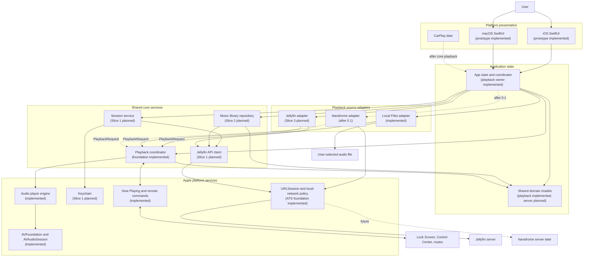
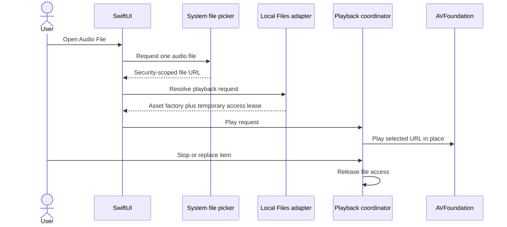
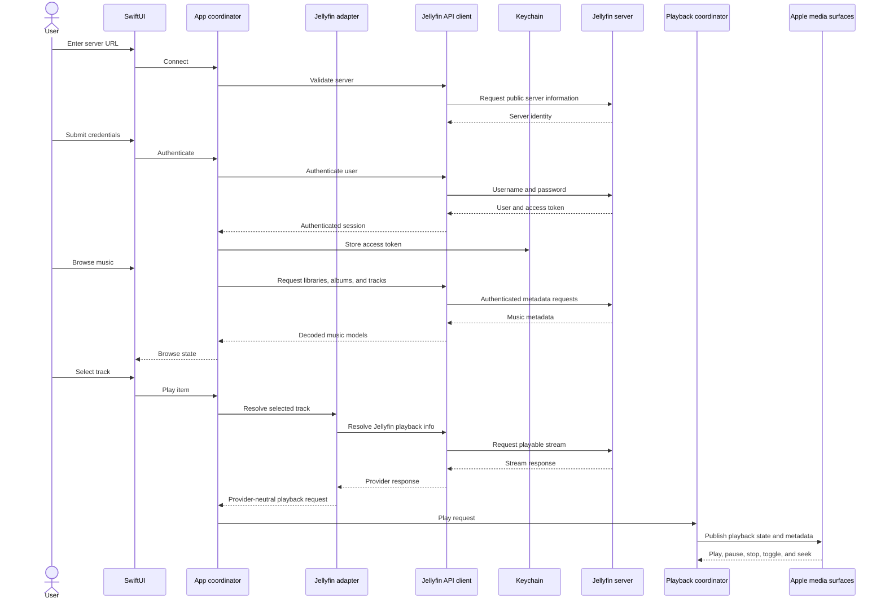
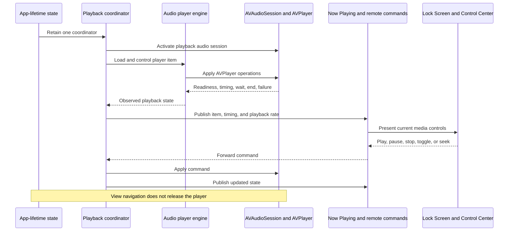

# Velacanto architecture

This document describes the intended 0.1.0 structure. It is a design target,
not a claim that every component has already been implemented. The
[roadmap](roadmap.md) is the source of truth for delivery status.

## Component map



Every source adapter asynchronously resolves its own selection into the same
provider-neutral playback request. The coordinator therefore sees display
metadata, an opaque resource lease, and a playback-asset factory rather than
Jellyfin, Navidrome, or file-picker details. Local Files passes the selected URL
through unchanged and holds its security-scoped access only for the active item.
The app owns this coordinator rather than an individual view, so playback and
the temporary file-access lease survive navigation and backgrounding until the
user stops playback, replaces the item, or the app terminates.

The main-actor playback engine owns AVFoundation and translates item readiness,
waiting, playing, pause, completion, stall, and failure events into an explicit
provider-neutral playback state. Periodic time observations update the in-app
progress display; system Now Playing metadata is republished only when the item,
duration, seek position, or playback state changes.

## Local-file playback journey



## Primary user journey



## Background and system-control lifecycle



## Responsibilities

| Component | Owns | Must not own |
| --- | --- | --- |
| SwiftUI surfaces | Presentation, navigation intent, accessible controls | Endpoint construction, token persistence, audio-session policy |
| App coordinator | Session state, loading state, navigation state, service coordination | Raw Keychain, URLSession, or AVFoundation calls |
| Session service | Authentication, restoration, logout, stable device identity | Password persistence or library browsing |
| Jellyfin API client | Authenticated requests, endpoint details, response decoding | UI state or playback controls |
| Library repository | Music views, albums, tracks, artwork, browse errors | Credential storage or audio routing |
| Playback source adapters | Asynchronous source-specific asset resolution and the shortest required access lifetime | Transport controls, audio-session policy, or unrelated source APIs |
| Playback coordinator | Observed player state, opaque resource leases, audio-session policy, interruptions, routes, and system controls | User authentication, source-specific resolution, or library presentation |
| AVFoundation playback engine | Player-item readiness, timing, waiting, completion, stalls, and failures | Source identity, navigation, or authentication |
| Platform adapters | Keychain, networking policy, audio, now-playing integration | Product navigation or domain rules |

## Security and privacy boundaries

- The password is transient and is not persisted by Velacanto.
- The access token is stored in Keychain and removed on logout.
- Tokens and passwords must not appear in logs, fixtures, screenshots, or Git.
- Remote servers use HTTPS by default.
- Local servers require an explicit local-network purpose string and the
  narrowest transport-security policy that supports the approved use case.
- The privacy manifest must reflect the APIs and data flows actually present in
  the shipped target.
- User-selected local files are played from their original URL. Velacanto does
  not copy, upload, index, or persist access to them.

## Source layout

The project now has the playback foundation in place. Planned directories are
listed here so new slices extend the established boundaries instead of moving
responsibilities into the prototype view:

```text
Velacanto/
├── App/                         # implemented: app-lifetime ownership
├── Features/
│   ├── Prototype/               # implemented: temporary foundation UI
│   ├── Connection/              # Slice 1
│   ├── Authentication/          # Slice 1
│   └── Library/                 # Slice 2
├── Core/
│   ├── Models/                  # implemented: source and playback contracts
│   ├── Playback/                # implemented: coordinator and player engine
│   ├── Session/                 # Slice 1
│   └── JellyfinAPI/             # Slice 1
├── Sources/
│   ├── LocalFiles/              # implemented
│   ├── Jellyfin/                # Slice 3
│   └── Navidrome/               # after 0.1
├── Platform/
│   ├── Media/                   # implemented
│   ├── Keychain/                # Slice 1
│   └── Networking/              # Slice 1
└── Resources/

VelacantoTests/
├── Playback/                    # implemented in the foundation test target
├── JellyfinAPI/                 # Slice 1
├── Session/                     # Slice 1
└── Features/                    # Slices 1 and 2
```

## Related documents

- [0.1.0 plan](0.1-plan.md)
- [Roadmap](roadmap.md)
- [Architecture decisions](decisions/README.md)
- [Interactive visualization](visualizations/README.md)
