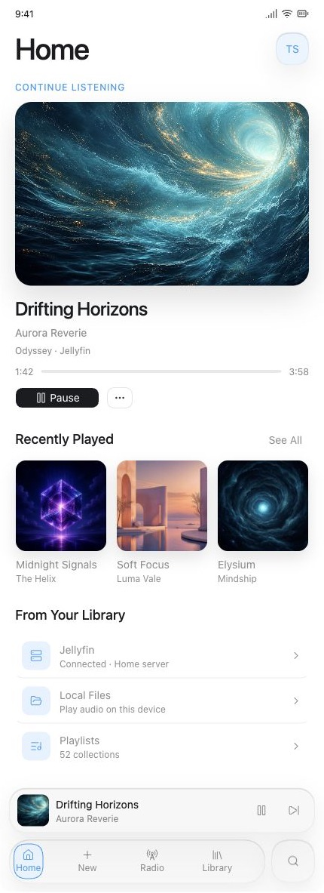
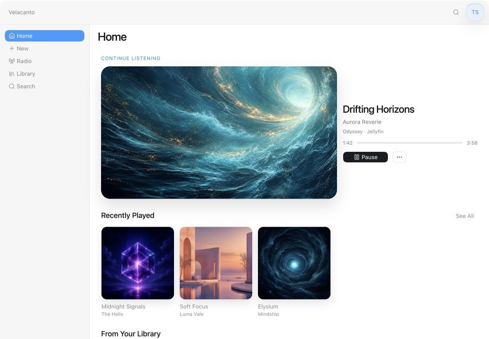

# Foundational product design

This section records Velacanto's approved visual direction for iOS and macOS.
It is a foundation for iteration, not a frozen production specification.

## Current direction

The July 29, 2026 concept combines:

- An artwork-led Home hierarchy with **Continue Listening**, **Recently
  Played**, and direct access to personal music sources.
- A light, system-native content canvas.
- Restrained Liquid Glass for navigation, account, and playback chrome.
- Primary navigation in this order: **Home**, **New**, **Radio**, **Library**,
  then **Search**.
- A split iOS navigation treatment with Home, New, Radio, and Library in the
  main glass capsule and Search in its own trailing control.
- A native macOS sidebar and toolbar rather than a stretched phone layout.
- Account access from Home. Broader preferences belong in the iOS Settings app
  where appropriate and in Velacanto's macOS Settings menu.

The direction is inspired by Apple Music's clarity and platform conventions,
but Velacanto retains its own cyan accent and personal-library focus.

## Implementation planning

[Native UI merge readiness](ui-merge-readiness.md) records the verified
functional baseline, native interface contract, issue-ready work packages,
open scope decisions, and acceptance gate for tying this design to the working
app.

## Interactive prototype

[Open the foundational UI prototype](foundational-ui.html).

Serve the repository over HTTP so the prototype can load its local artwork:

```sh
python3 -m http.server 8000
```

Then open:

```text
http://localhost:8000/docs/design/foundational-ui.html
```

The prototype includes:

- iPhone and macOS layouts.
- Home, New, Radio, Library, and Search navigation.
- Playing and Nothing Playing states.
- Album selection and play/pause behavior.
- Account access.
- The macOS Velacanto menu and Settings surface.

## iOS reference



## macOS reference



## Implementation guidance

- Use native SwiftUI navigation and presentation components wherever they
  produce the intended behavior.
- Treat Liquid Glass as navigation and playback material, not as a decorative
  surface for every content section.
- Preserve readable contrast when artwork influences surrounding color.
- Use availability checks and compatible fallbacks because the project targets
  iOS 18 and macOS 15 while building with newer SDKs.
- Adapt navigation to each platform: bottom navigation on iPhone and a sidebar
  plus toolbar on macOS.
- Keep the mini-player persistent across navigation and backed by the shared
  playback coordinator.
- Replace the fictional artwork and metadata before production use.

## Design assets

The artwork in `assets/` was generated specifically for this design prototype.
It is checked in so the reference remains reproducible and does not depend on
remote image services.
